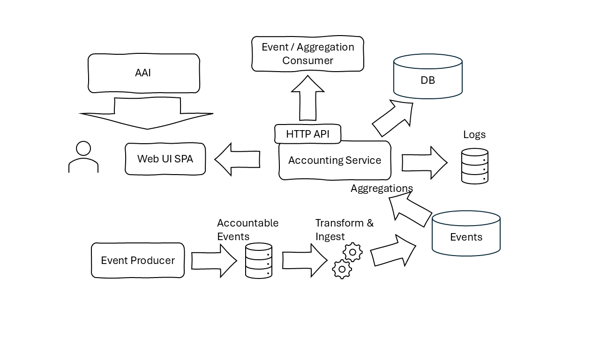

# Service Architecture

The Gateway API service offers an entrypoint to the platform functionality for integrating services as well as the platform's user interface. It manages edge authentication and authorization while also performing model aggregations and transformations were needed. It provides a uniform view over the TERRA functionality, composing and masking underpinning service offerings and APIs.

A general architecural view of the service is presented in the following diagram:

The Gateway API relies on the [TERRA AAI](https://terra-horizon.github.io/terra-aai) to propvide central authentication for the callers (end users and integrating services). The AAI endpoints are used both the authenticate external endpoint requests as well as to authorize the reqeusted actions. Additionally, the AAI endpoints are used to retrieve access tokens for the Gateway API's requests to other Terra components, generating new tokens or exchanging request tokens for ones that can be used to forward processing to underpinning services. Thes supported flows and access level processing is presented in the respective [Security](security.md) sections.

During its operation, the service generates troubleshooting logs made available to the [Logging Service](https://terra-horizon.github.io/terra-logging). The same flow that generated and aggregates troubleshooting logs includes also accounting events that are harvested for the Gateway by the [Accounting Service](https://terra-horizon.github.io/terra-accounting).

Underpinning TERRA services are integrated with the Gategeway API through their HTTP endpoints. The primary integration targets are:

* [Data Workflow Orchestrator](https://terra-horizon.github.io/terra-data-workflow) - This integration handles data management flows, including model inference, maintenance tasks, etc

Additional integrations are available with explicit TERRA componenents.